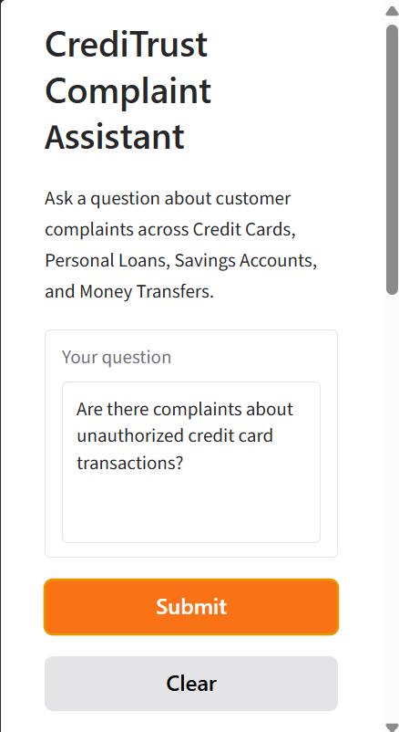

# RAG Complaint Chatbot

An internal AI assistant for CrediTrust Financial that lets Product, Support, and Compliance teams ask plain-English questions about customer complaints and receive evidence-backed answers in seconds, instead of manually reading through thousands of complaint narratives.

## Overview

CrediTrust Financial is a digital finance company serving East African markets across four product lines: Credit Cards, Personal Loans, Savings Accounts, and Money Transfers. With over 500,000 users, the company receives thousands of customer complaints every month through in-app channels, email, and regulatory reporting portals.

This project turns that raw, unstructured complaint data into a searchable knowledge base using Retrieval-Augmented Generation (RAG), grounding AI-generated answers in real customer complaints rather than relying on a language model's unguided assumptions.

## How It Works

1. **Data preprocessing** — Raw CFPB complaint data is filtered to the four target product categories, cleaned of boilerplate and redactions, and normalized.
2. **Chunking and embedding** — Complaint narratives are split into overlapping text chunks (500 characters, 50-character overlap) and converted into 384-dimensional vector embeddings using `sentence-transformers/all-MiniLM-L6-v2`.
3. **Vector search** — A FAISS index enables fast semantic similarity search across the full embedded complaint corpus, spanning over 1.37 million chunks from more than 460,000 complaints.
4. **Retrieval-augmented generation** — User questions are embedded using the same model, matched against the most relevant complaint excerpts, and passed to a language model that generates an answer grounded in those excerpts.
5. **Interactive interface** — A Gradio-based chat interface lets non-technical users ask questions and see both the generated answer and the original complaint excerpts behind it, supporting trust and verification.

## Tech Stack

- **Embedding model:** `sentence-transformers/all-MiniLM-L6-v2` (384 dimensions)
- **Vector store:** FAISS (`IndexFlatL2`)
- **Chunking:** LangChain `RecursiveCharacterTextSplitter`
- **Language model:** Hugging Face `google/flan-t5-base`
- **Interface:** Gradio

## Project Structure

```
rag-complaint-chatbot/
├── data/
│   ├── raw/
│   └── processed/
├── notebooks/
│   └── screenshots/
├── src/
├── tests/
├── vector_store/
├── app.py
├── requirements.txt
└── README.md
```

## Getting Started

```bash
# create and activate a virtual environment
python -m venv venv
source venv/Scripts/activate   # Windows Git Bash
# or: source venv/bin/activate   # macOS/Linux

# install dependencies
pip install -r requirements.txt

# run the chat interface
python app.py
```

The app will print a local URL once the vector store has loaded and the models are ready.

## UI Showcase



**Example query:**

> **Question:** why customer is un happy
>
> **Answer:** they are not satisfied with the service they received from the company they used to work for.
>
> **Sources retrieved:**
> - Savings Account — U.S. Bancorp
> - Credit Card — JPMorgan Chase & Co.
> - Money Transfer — PayPal Holdings, Inc.

## Key Design Decisions

- **Stratified sampling** during development preserved the real-world product distribution rather than artificially balancing categories, so retrieval reflects actual complaint frequency.
- **500-character chunks with 50-character overlap** match the production embedding specification, keeping development directly comparable to the full-scale vector store.
- **`all-MiniLM-L6-v2`** was chosen for its balance of speed and semantic accuracy on short-to-medium text, and because it matches the embedding model used to build the full-scale vector store.
- **FAISS `IndexFlatL2`** provides exact, non-approximate similarity search, which is fast enough at this corpus size without the added complexity of an approximate index.

## Evaluation

The RAG pipeline was evaluated against a set of representative questions covering each product category and common complaint themes (fraud, customer service, billing disputes). Each answer was scored for groundedness, specificity, and coherence. Results showed the system reliably surfaces relevant complaint excerpts through retrieval, while answer generation quality varies with question specificity — a known limitation of small, free open-source language models that future iterations could address with a larger or fine-tuned model.

## Future Improvements

- Upgrade to a larger or instruction-tuned language model for more coherent, less repetitive generated answers
- Add response streaming to the chat interface
- Support multi-product comparison queries
- Add automated regression testing for retrieval quality